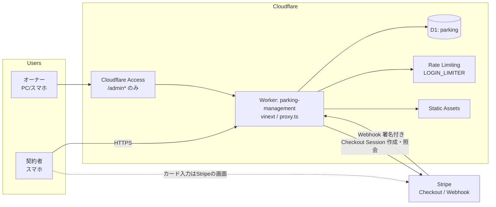
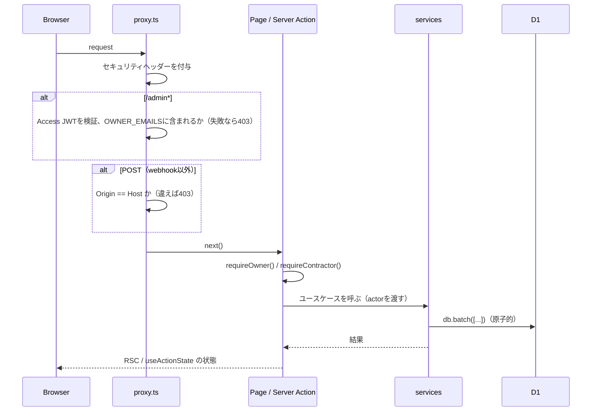

# 3. アーキテクチャ

## 3.1 技術スタック

2026-09-12 時点の最新版を基準にし、実装開始時に `npm view` で確認してから固定します。

| 領域           | 採用                                                                  | バージョン目安                                  | 備考                                                             |
| -------------- | --------------------------------------------------------------------- | ----------------------------------------------- | ---------------------------------------------------------------- |
| ランタイム     | Cloudflare Workers                                                    | compatibility_date 2026-09-01 / `nodejs_compat` |                                                                  |
| フレームワーク | vinext（Next.js App Router 互換、Vite ベース）                        | vinext 1.0.0-beta.x / next 16.3 / react 19.3    | デプロイは `@vinext/cloudflare`。独自のWorker入口は不要          |
| DB             | Cloudflare D1                                                         | –                                               |                                                                  |
| ORM            | drizzle-orm / drizzle-kit                                             | 0.45 / 0.31                                     | `drizzle-orm/d1`、`db.batch()`                                   |
| バリデーション | zod                                                                   | 4.x                                             | スキーマはフォームとサーバーで共有                               |
| 認証           | jose                                                                  | 6.x                                             | 契約者セッションの署名とAccess JWTの検証（`createRemoteJWKSet`） |
| 決済           | stripe                                                                | 22.x                                            | `createFetchHttpClient` / `constructEventAsync`                  |
| UI             | Tailwind CSS 4 / shadcn/ui（`radix-ui` 統合パッケージ）/ lucide-react | 4.3 / 最新                                      | 旧実装の `components/ui` は再生成する                            |
| QRコード       | `uqr`（依存ゼロでSVGを生成）                                          | 最新                                            | サーバー側でSVGを生成し、ログインカードを印刷する                |
| テスト         | vitest / `@cloudflare/vitest-pool-workers` / Playwright               | 5.x / 0.22 / 1.63                               |                                                                  |
| Lint/Format    | ESLint 9（flat config）/ Prettier                                     |                                                 |                                                                  |
| Node           | 24 LTS                                                                |                                                 | `.node-version`                                                  |
| CI/CD          | GitHub Actions + wrangler                                             | wrangler 4.13x                                  |                                                                  |

> **vinextのリスクと退避策**: vinextは「本番利用はまだ推奨されない」段階です。そこでアプリのコードは、標準のNext.js API（`next/navigation`, `next/headers`, `next/cache`, Server Actions, Route Handlers, `proxy.ts`）と `cloudflare:workers` の `env` だけで書きます。vinextで問題が出た場合は、`@opennextjs/cloudflare` にビルドとデプロイの設定だけを差し替えて移れるようにしておきます。`next/font` は使いません（vinextでは部分対応のため）。

## 3.2 全体構成



## 3.3 Cloudflareリソース

| 種類               | 名前                                                           | 用途                                                                                                        |
| ------------------ | -------------------------------------------------------------- | ----------------------------------------------------------------------------------------------------------- |
| Worker             | `parking-management`                                           | アプリ本体。URLは `https://parking-management.hiraku00.workers.dev`（独自ドメインは任意）                   |
| D1                 | `parking`                                                      | 全データ                                                                                                    |
| Access Application | `parking-admin`                                                | 対象: `<host>/admin`（配下を含む）。ポリシー: オーナーのメールのみ許可。IdP: One-time PIN。セッション24時間 |
| Rate Limiting      | `LOGIN_LIMITER`（namespace 例 `3001`）                         | 予備ログイン: 1IPにつき60秒で10回                                                                           |
| Secrets            | `SESSION_SECRET`, `STRIPE_SECRET_KEY`, `STRIPE_WEBHOOK_SECRET` | `wrangler secret put`                                                                                       |
| Vars               | `APP_ENV`, `ACCESS_TEAM_DOMAIN`, `ACCESS_AUD`, `OWNER_EMAILS`  | `wrangler.jsonc` に記載                                                                                     |

### `wrangler.jsonc`（案）

```jsonc
{
  "$schema": "node_modules/wrangler/config-schema.json",
  "name": "parking-management",
  "compatibility_date": "2026-09-01",
  "compatibility_flags": ["nodejs_compat"],
  "preview_urls": false, // preview URL は Access の対象外になるため無効にする
  "observability": { "enabled": true },
  "d1_databases": [
    { "binding": "DB", "database_name": "parking", "database_id": "<id>", "migrations_dir": "migrations" },
  ],
  "ratelimits": [
    { "name": "LOGIN_LIMITER", "namespace_id": "3001", "simple": { "limit": 10, "period": 60 } },
  ],
  "vars": {
    "APP_ENV": "production",
    "ACCESS_TEAM_DOMAIN": "<team>.cloudflareaccess.com",
    "ACCESS_AUD": "<aud>",
    "OWNER_EMAILS": "hiraku00@gmail.com",
  },
}
```

ローカルでは `.dev.vars`（gitignoreに入れる）に `APP_ENV=development`、`SESSION_SECRET`、Stripeのテストキー、`DEV_OWNER_EMAIL` を置きます。

## 3.4 ディレクトリ構成

```
.
├─ app/
│  ├─ layout.tsx                  # <html lang="ja">、共通メタ情報
│  ├─ globals.css                 # Tailwind 4 と、システムの日本語フォント
│  ├─ page.tsx                    # 契約者ログイン（/）
│  ├─ login/actions.ts            # 予備ログイン（氏名＋下4桁）、ログアウト
│  ├─ l/[token]/route.ts          # QRログイン → Cookie発行 → /portal
│  ├─ portal/                     # 契約者画面（layoutでセッション必須）
│  │  ├─ page.tsx                 # ホーム: 未払い、処理中、履歴
│  │  ├─ pay/page.tsx             # 支払う月の選択 → 支払い方法
│  │  ├─ pay/transfer/page.tsx    # 振込先の表示 → 振込報告
│  │  ├─ payments/[id]/complete/page.tsx  # Stripeからの戻り（状態の照会）
│  │  ├─ payments/[id]/receipt/page.tsx   # 領収書（印刷用）
│  │  └─ actions.ts
│  ├─ admin/                      # オーナー画面（proxyでAccess検証、各アクションでrequireOwner）
│  │  ├─ page.tsx                 # ダッシュボード＋入金マトリクス
│  │  ├─ contractors/…            # 一覧 / 新規 / [id]詳細 / [id]/login-card
│  │  ├─ payments/…               # 一覧 / [id]詳細 / [id]/receipt
│  │  ├─ settings/page.tsx
│  │  ├─ audit/page.tsx
│  │  └─ actions/*.ts             # 画面単位でファイルを分ける
│  ├─ legal/tokushoho/page.tsx
│  ├─ legal/privacy/page.tsx
│  └─ api/
│     ├─ webhooks/stripe/route.ts
│     └─ health/route.ts
├─ proxy.ts                       # Access検証（/admin*）、Origin検証、セキュリティヘッダー
├─ lib/
│  ├─ env.ts                      # cloudflare:workers の env を型付きで取り出す
│  ├─ db/
│  │  ├─ schema.ts                # Drizzleのスキーマ（正はここだけ）
│  │  └─ client.ts                # getDb() = drizzle(env.DB, { schema })
│  ├─ domain/                     # DBに依存しない純関数（単体テストの中心）
│  │  ├─ time.ts                  # JSTの月計算、YearMonth型、表示の整形
│  │  ├─ billing.ts               # 請求すべき月の算出、配分（古い月から順）
│  │  ├─ money.ts                 # 円の整形、内税の消費税額
│  │  └─ names.ts                 # 氏名の正規化（login_key）
│  ├─ services/                   # ユースケース（DBとStripeを使う。Server Actionから呼ぶ）
│  │  ├─ invoices.ts              # syncInvoices, voidInvoice, applyFeeChange
│  │  ├─ payments.ts              # startCardCheckout, fulfillCheckout, reportTransfer, approve, reject, recordManual
│  │  ├─ contractors.ts
│  │  ├─ receipts.ts
│  │  ├─ settings.ts
│  │  ├─ queries.ts               # 画面表示用の読み取り（ダッシュボード、マトリクス）
│  │  └─ audit.ts
│  ├─ auth/
│  │  ├─ contractor-session.ts    # Cookieの発行と検証、requireContractor()
│  │  ├─ login-token.ts           # QRトークンの生成とハッシュ
│  │  └─ owner.ts                 # Access JWTの検証、getOwner(), requireOwner()
│  ├─ stripe.ts                   # getStripe()、webCrypto
│  └─ validation.ts               # zodスキーマ（フォームとサーバーで共有）
├─ components/
│  ├─ ui/                         # shadcn/ui
│  ├─ portal/                     # 大きな文字の部品（BigButton、MonthCard、StatusBadge…）
│  ├─ admin/                      # PaymentMatrix、ContractorForm…
│  └─ receipt/Receipt.tsx         # 契約者画面と管理画面で共用
├─ migrations/                    # drizzle-kit generate の出力（wrangler がそのまま適用）
├─ db/seed.dev.sql                # ローカル専用のシード
├─ tests/
│  ├─ unit/                       # lib/domain
│  ├─ integration/                # vitest-pool-workers + D1（services と webhook）
│  └─ e2e/                        # Playwright
├─ drizzle.config.ts
├─ vite.config.ts
├─ wrangler.jsonc
└─ .github/workflows/{ci.yml,deploy.yml}
```

### レイヤーのルール

- `app/*`（ページとServer Action）は、**入力の検証 → 認可 → services呼び出し → 結果を返す**だけにする。SQLを直接書かない。
- `lib/services/*` は業務ルールとトランザクション（`db.batch`）を担う。認可済みの主体（`actor`）を引数で受け取る。
- `lib/domain/*` は純関数だけにする。時刻は引数で受け取る（テストできるように）。
- `cloudflare:workers` の `env` に触れるのは `lib/env.ts` だけにする。OpenNextへ移るときの差し替え箇所をここに限定するため。

## 3.5 リクエストの流れ



## 3.6 環境

| 環境       | Worker                    | D1                         | Stripe                                                       | Access                                                   |
| ---------- | ------------------------- | -------------------------- | ------------------------------------------------------------ | -------------------------------------------------------- |
| local      | `vinext dev`（miniflare） | ローカルD1（`.wrangler/`） | テストキー＋`stripe listen`                                  | バイパス（`APP_ENV=development` かつ `DEV_OWNER_EMAIL`） |
| production | `parking-management`      | `parking`                  | **リリースまではテストキー**、リリース日に本番キーへ切り替え | 有効                                                     |

staging環境は作りません。本番のWorkerをテストモードのまま実際のURLで検証し、リリース時にDBを初期化してから本番キーに切り替えます（§08 リリース手順）。
