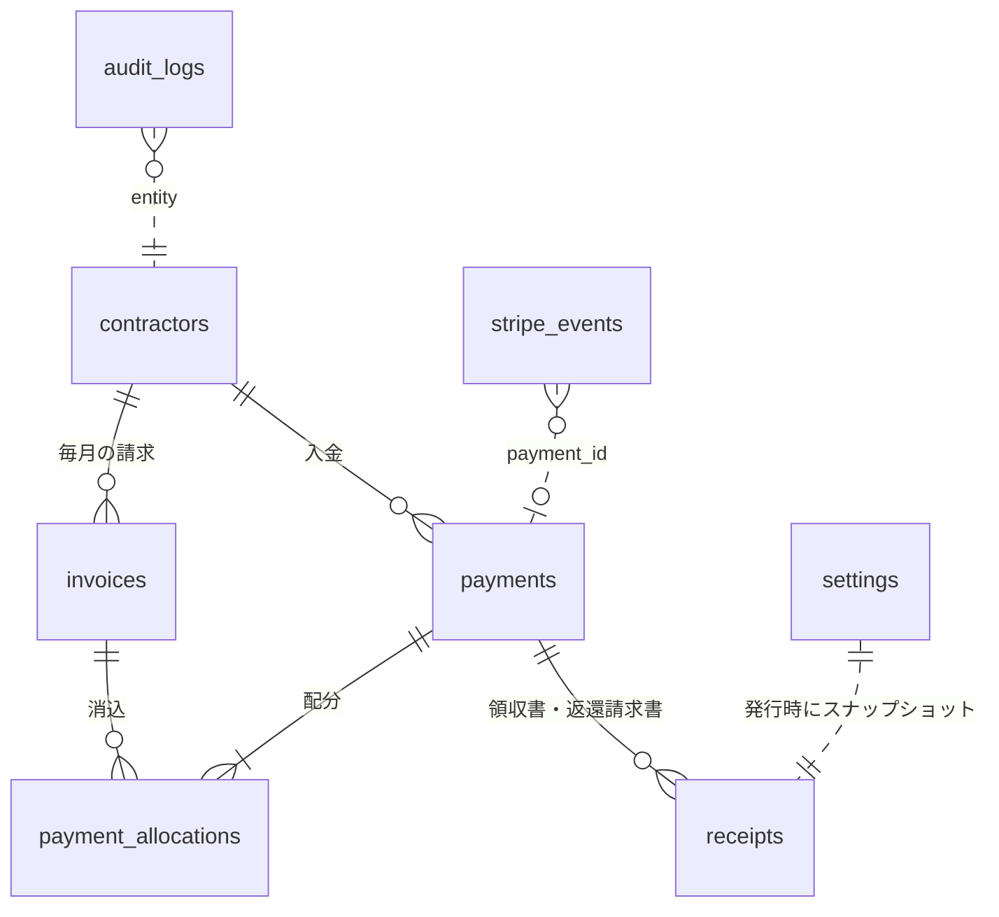
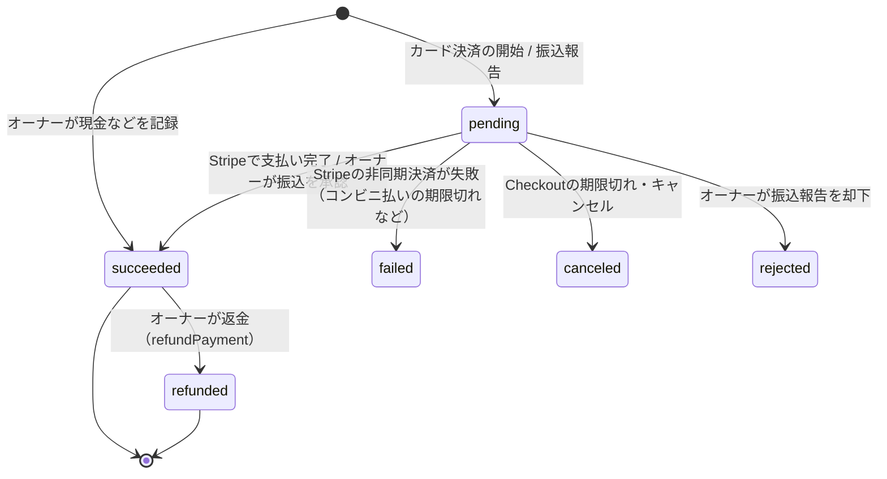
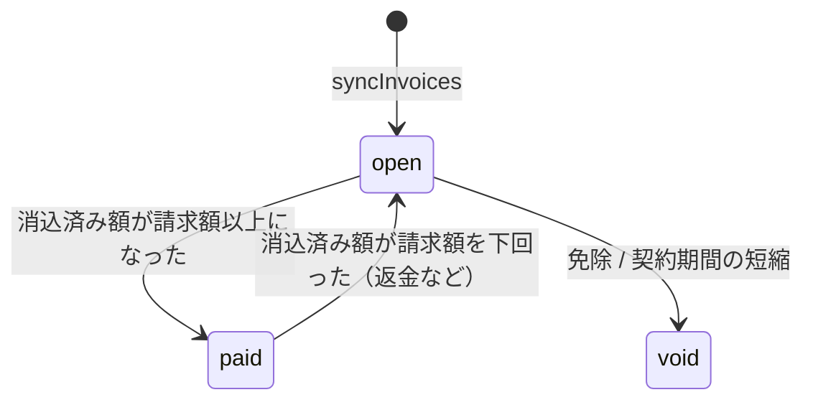

# 4. データモデル

## 4.1 ER図



## 4.2 方針

- **ID**: `TEXT`（`crypto.randomUUID()`）。領収書番号だけは別に連番を持つ。
- **時刻**: `INTEGER` のUTCミリ秒（Drizzleの `mode: "timestamp_ms"`、アプリ側では `Date`）。
- **業務日付**: `TEXT`。月は `YYYY-MM`、日は `YYYY-MM-DD`（JST）。
- **金額**: `INTEGER`（円）。すべて税込（内税）。
- **物理削除しない**: 契約者は `archived_at`、請求は `status='void'`、入金は状態遷移で扱う。
- **スキーマの正は `lib/db/schema.ts` だけ**。`drizzle-kit generate` で `migrations/*.sql` を生成し、`wrangler d1 migrations apply` で適用する。
- D1は外部キー制約を既定で強制する。複数の書き込みは `db.batch()` で原子的に実行する（途中で1つでも失敗すれば全体がロールバックされる）。

## 4.3 スキーマ（`lib/db/schema.ts`）

```ts
import { sql } from 'drizzle-orm'
import { sqliteTable, text, integer, primaryKey, index, uniqueIndex, check } from 'drizzle-orm/sqlite-core'

const id = () =>
  text('id')
    .primaryKey()
    .$defaultFn(() => crypto.randomUUID())
const ts = (name: string) => integer(name, { mode: 'timestamp_ms' })
const createdAt = () =>
  ts('created_at')
    .notNull()
    .$defaultFn(() => new Date())
const updatedAt = () =>
  ts('updated_at')
    .notNull()
    .$defaultFn(() => new Date())
    .$onUpdateFn(() => new Date())
const YM = (col: string) => sql.raw(`${col} GLOB '[0-9][0-9][0-9][0-9]-[01][0-9]'`)

// ─── 契約者 ───────────────────────────────────────────────
export const contractors = sqliteTable(
  'contractors',
  {
    id: id(),
    name: text('name').notNull(), // 表示名（例: 田中 太郎）
    nameKana: text('name_kana'), // 並び替えと振込名義の照合用（任意）
    loginKey: text('login_key').notNull(), // normalizeName(name)（NFKC、空白除去）
    phone: text('phone').notNull(),
    phoneLast4: text('phone_last4').notNull(),
    spaceLabel: text('space_label'), // 区画（例: "A-3"）
    monthlyFee: integer('monthly_fee').notNull(), // 次に請求を作るときの月額
    contractStartMonth: text('contract_start_month').notNull(),
    contractEndMonth: text('contract_end_month'), // null = 無期限
    note: text('note'),
    sessionVersion: integer('session_version').notNull().default(1),
    loginTokenHash: text('login_token_hash'), // SHA-256(base64url)。QRログイン用
    loginTokenIssuedAt: ts('login_token_issued_at'),
    failedLoginCount: integer('failed_login_count').notNull().default(0),
    lockedUntil: ts('locked_until'),
    archivedAt: ts('archived_at'),
    createdAt: createdAt(),
    updatedAt: updatedAt(),
  },
  (t) => [
    // アーカイブ済みの人とは同名でも登録できるよう、部分UNIQUEにする
    uniqueIndex('contractors_login_key_uq')
      .on(t.loginKey)
      .where(sql`archived_at IS NULL`),
    uniqueIndex('contractors_login_token_uq').on(t.loginTokenHash),
    check('contractors_fee_chk', sql`monthly_fee > 0`),
    check('contractors_start_chk', YM('contract_start_month')),
    check(
      'contractors_end_chk',
      sql`contract_end_month IS NULL OR (${YM('contract_end_month')} AND contract_end_month >= contract_start_month)`,
    ),
    check('contractors_last4_chk', sql`phone_last4 GLOB '[0-9][0-9][0-9][0-9]'`),
  ],
)

// ─── 月次請求 ─────────────────────────────────────────────
export const invoices = sqliteTable(
  'invoices',
  {
    id: id(),
    contractorId: text('contractor_id')
      .notNull()
      .references(() => contractors.id),
    month: text('month').notNull(), // YYYY-MM（対象月）
    amount: integer('amount').notNull(), // 請求を作った時点で固定する
    status: text('status', { enum: ['open', 'paid', 'void'] })
      .notNull()
      .default('open'),
    paidAt: ts('paid_at'),
    voidedAt: ts('voided_at'),
    voidReason: text('void_reason'),
    createdAt: createdAt(),
    updatedAt: updatedAt(),
  },
  (t) => [
    uniqueIndex('invoices_contractor_month_uq').on(t.contractorId, t.month),
    index('invoices_status_month_idx').on(t.status, t.month),
    check('invoices_amount_chk', sql`amount > 0`),
    check('invoices_month_chk', YM('month')),
    check('invoices_status_chk', sql`status IN ('open','paid','void')`),
  ],
)

// ─── 入金 ─────────────────────────────────────────────────
export const PAYMENT_METHODS = ['card', 'bank_transfer', 'cash', 'other'] as const
export const PAYMENT_STATUSES = [
  'pending',
  'succeeded',
  'failed',
  'canceled',
  'rejected',
  'refunded',
] as const

export const payments = sqliteTable(
  'payments',
  {
    id: id(),
    contractorId: text('contractor_id')
      .notNull()
      .references(() => contractors.id),
    method: text('method', { enum: PAYMENT_METHODS }).notNull(),
    channel: text('channel', { enum: ['portal', 'admin'] }).notNull(), // 誰が起点になったか
    status: text('status', { enum: PAYMENT_STATUSES }).notNull(),
    amount: integer('amount').notNull(),
    // Stripe
    stripeCheckoutSessionId: text('stripe_checkout_session_id'),
    stripePaymentIntentId: text('stripe_payment_intent_id'),
    stripePaymentMethodType: text('stripe_payment_method_type'), // card / konbini / paypay …
    stripeRefundId: text('stripe_refund_id'),
    // 振込・現金
    payerName: text('payer_name'), // 振込名義
    paidOn: text('paid_on'), // 振込日・受領日（YYYY-MM-DD、JST）
    note: text('note'),
    // 審査
    reviewedBy: text('reviewed_by'), // オーナーのメール
    reviewedAt: ts('reviewed_at'),
    rejectReason: text('reject_reason'),
    succeededAt: ts('succeeded_at'),
    // 返金（succeededからのみ遷移。全額返金のみ、部分返金は対象外）
    refundedAt: ts('refunded_at'),
    refundedBy: text('refunded_by'), // オーナーのメール
    refundReason: text('refund_reason'),
    refundMethod: text('refund_method', { enum: ['card', 'bank_transfer', 'cash'] }),
    createdAt: createdAt(),
    updatedAt: updatedAt(),
  },
  (t) => [
    uniqueIndex('payments_checkout_session_uq').on(t.stripeCheckoutSessionId),
    index('payments_contractor_created_idx').on(t.contractorId, t.createdAt),
    index('payments_status_idx').on(t.status),
    check('payments_amount_chk', sql`amount > 0`),
    check('payments_method_chk', sql`method IN ('card','bank_transfer','cash','other')`),
    check(
      'payments_status_chk',
      sql`status IN ('pending','succeeded','failed','canceled','rejected','refunded')`,
    ),
    check(
      'payments_refund_method_chk',
      sql`refund_method IS NULL OR refund_method IN ('card','bank_transfer','cash')`,
    ),
  ],
)

// ─── 入金配分（どの請求にいくら充てたか）─────────────────
export const payment_allocations = sqliteTable(
  'payment_allocations',
  {
    paymentId: text('payment_id')
      .notNull()
      .references(() => payments.id),
    invoiceId: text('invoice_id')
      .notNull()
      .references(() => invoices.id),
    amount: integer('amount').notNull(),
    // 入金の状態を写したもの: pending=確保中 / applied=消込済み / released=解放済み
    state: text('state', { enum: ['pending', 'applied', 'released'] }).notNull(),
  },
  (t) => [
    primaryKey({ columns: [t.paymentId, t.invoiceId] }),
    index('allocations_invoice_idx').on(t.invoiceId, t.state),
    // 1つの請求を確保できる「処理中の入金」は1件だけ（二重決済をDBで防ぐ）
    uniqueIndex('allocations_one_pending_per_invoice_uq')
      .on(t.invoiceId)
      .where(sql`state = 'pending'`),
    check('allocations_amount_chk', sql`amount > 0`),
  ],
)

// ─── 領収書（入金1件につき、kindごとに1枚。発行時の情報を保存）───
// kind: 'receipt'=通常の領収書 / 'credit_note'=返金時の適格返還請求書。
// 返金した入金は領収書1枚＋返還請求書1枚を持てる（`receipts_payment_kind_uq`）。
export const RECEIPT_KINDS = ['receipt', 'credit_note'] as const

export const receipts = sqliteTable(
  'receipts',
  {
    id: id(),
    receiptNo: integer('receipt_no').notNull(), // 連番（1, 2, 3…。領収書・返還請求書で共通の通し番号）
    kind: text('kind', { enum: RECEIPT_KINDS }).notNull().default('receipt'),
    paymentId: text('payment_id')
      .notNull()
      .references(() => payments.id),
    issuedAt: ts('issued_at').notNull(),
    transactionDate: text('transaction_date').notNull(), // 取引日（YYYY-MM-DD、JST）
    recipientName: text('recipient_name').notNull(),
    description: text('description').notNull(), // 例: 駐車場使用料 2026年10月分〜12月分（区画A-3）
    amount: integer('amount').notNull(),
    taxRate: integer('tax_rate').notNull(), // 10
    taxAmount: integer('tax_amount').notNull(), // 内税額 = floor(amount * rate / (100 + rate))
    paymentMethodLabel: text('payment_method_label').notNull(),
    issuer: text('issuer', { mode: 'json' }).notNull().$type<IssuerSnapshot>(),
    createdAt: createdAt(),
  },
  (t) => [
    uniqueIndex('receipts_no_uq').on(t.receiptNo),
    uniqueIndex('receipts_payment_kind_uq').on(t.paymentId, t.kind),
    check('receipts_kind_chk', sql`kind IN ('receipt','credit_note')`),
  ],
)

export type IssuerSnapshot = {
  businessName: string
  address: string
  phone: string | null
  registrationNumber: string | null
}

// ─── 設定（1行だけ）──────────────────────────────────────
export const settings = sqliteTable(
  'settings',
  {
    id: integer('id').primaryKey(), // 常に 1
    businessName: text('business_name').notNull().default(''),
    businessAddress: text('business_address').notNull().default(''),
    businessPhone: text('business_phone'),
    invoiceRegistrationNumber: text('invoice_registration_number'), // T + 13桁
    taxRate: integer('tax_rate').notNull().default(10),
    bankName: text('bank_name'),
    bankBranch: text('bank_branch'),
    bankAccountType: text('bank_account_type', { enum: ['普通', '当座'] }),
    bankAccountNumber: text('bank_account_number'),
    bankAccountHolderKana: text('bank_account_holder_kana'),
    cardPaymentEnabled: integer('card_payment_enabled', { mode: 'boolean' }).notNull().default(true),
    bankTransferEnabled: integer('bank_transfer_enabled', { mode: 'boolean' }).notNull().default(true),
    invoiceLeadMonths: integer('invoice_lead_months').notNull().default(1), // 何か月先の分まで請求を作るか（前払い。初期値1=翌月分まで）
    updatedAt: updatedAt(),
  },
  () => [check('settings_singleton_chk', sql`id = 1`)],
)

// ─── 監査ログ ─────────────────────────────────────────────
export const audit_logs = sqliteTable(
  'audit_logs',
  {
    id: id(),
    actor: text('actor').notNull(), // owner:<email> | contractor:<id> | stripe | system
    action: text('action').notNull(), // 例: payment.approve, contractor.update
    entityType: text('entity_type').notNull(),
    entityId: text('entity_id').notNull(),
    detail: text('detail', { mode: 'json' }).$type<Record<string, unknown>>(),
    dedupeKey: text('dedupe_key'), // Webhook等の重複を防ぐ（例: stripe event id）
    createdAt: createdAt(),
  },
  (t) => [
    index('audit_entity_idx').on(t.entityType, t.entityId),
    index('audit_created_idx').on(t.createdAt),
    uniqueIndex('audit_dedupe_uq').on(t.dedupeKey),
  ],
)

// ─── Stripeイベントの受信記録（重複排除と調査用）─────────
export const stripe_events = sqliteTable('stripe_events', {
  id: text('id').primaryKey(), // evt_...
  type: text('type').notNull(),
  paymentId: text('payment_id'),
  receivedAt: createdAt(),
})
```

## 4.4 導出する値と不変条件

| 名前                  | 定義                                                                                        |
| --------------------- | ------------------------------------------------------------------------------------------- |
| 消込済み額（invoice） | `SUM(allocations.amount WHERE invoice_id = ? AND state = 'applied')`                        |
| 残額（invoice）       | `amount - 消込済み額`（`status='void'` のときは0）                                          |
| 支払える請求          | `status='open'` かつ、`state='pending'` の配分が無く、`month <= 当月 + invoice_lead_months` |
| 滞納                  | `status='open'` かつ `month < 当月(JST)`                                                    |

**不変条件**（servicesで守り、統合テストで確認する）

1. 入金の `amount` = その入金の配分額の合計
2. 配分の `state` は入金の `status` と対応する（pending→pending、succeeded→applied、それ以外→released）
3. 請求の `status='paid'` ⇔ 消込済み額 ≥ `amount`
4. 1つの請求を確保できる pending の入金は1件まで（部分UNIQUE索引）
5. 領収書（`kind='receipt'`）は `status='succeeded'` または `'refunded'`（返金前にsucceededだった）
   の入金にだけ、1件存在する。返還請求書（`kind='credit_note'`）は `status='refunded'` の
   入金にだけ、1件存在する（発行済みの領収書は返金後も残す。物理削除しない）
6. `void` の請求には `applied` の配分が無い

## 4.5 状態遷移

### 入金（payments.status）



succeeded になるとき、同じbatchで次の3つを行う。配分を `applied` にする → 対象の請求の `status` を再計算する → 領収書を発行する。
failed / canceled / rejected になるときは、配分を `released` にする（請求が再び支払える状態に戻る）。
refunded になるとき（`refundPayment`）も同様に配分を `released` にし、請求を再計算する（`paid → open`）。
カード決済は同じbatchでStripeへ実際に返金し、現金・振込は記録のみ行う。全額返金のみ対応
（部分返金は対象外）。入金は物理削除せず、適格返還請求書（`receipts.kind='credit_note'`）を
1枚発行する。参照: docs/design/06-billing-payments.md §6.9, docs/design/12-review-followups.md §12.2

### 請求（invoices.status）



## 4.6 よく使うクエリ（抜粋）

```sql
-- 契約者の支払える請求（古い月から）
SELECT i.*, i.amount - COALESCE(SUM(CASE WHEN a.state='applied' THEN a.amount END),0) AS remaining
FROM invoices i
LEFT JOIN payment_allocations a ON a.invoice_id = i.id
WHERE i.contractor_id = ?1 AND i.status = 'open' AND i.month <= ?2
  AND NOT EXISTS (SELECT 1 FROM payment_allocations p WHERE p.invoice_id = i.id AND p.state = 'pending')
GROUP BY i.id ORDER BY i.month;

-- 請求の状態を再計算する（入金が確定したときのbatch内で使う）
WITH settled AS (
  SELECT i.id, (SELECT COALESCE(SUM(a.amount),0) FROM payment_allocations a
                WHERE a.invoice_id = i.id AND a.state = 'applied') >= i.amount AS is_paid
  FROM invoices i
  WHERE i.id IN (SELECT invoice_id FROM payment_allocations WHERE payment_id = ?1) AND i.status != 'void'
)
UPDATE invoices SET
  status  = CASE WHEN s.is_paid THEN 'paid' ELSE 'open' END,
  paid_at = CASE WHEN s.is_paid THEN COALESCE(invoices.paid_at, ?now) ELSE NULL END,
  updated_at = ?now
FROM settled s WHERE invoices.id = s.id;

-- 領収書の連番を採番して挿入する（SQLiteは書き込みが直列なので1文で安全。OR IGNOREで冪等になる）
INSERT OR IGNORE INTO receipts (id, receipt_no, payment_id, ...)
SELECT ?id, COALESCE((SELECT MAX(receipt_no) FROM receipts), 0) + 1, p.id, ...
FROM payments p WHERE p.id = ?1 AND p.status = 'succeeded';
```

Drizzleのクエリビルダーで書きにくいもの（上の条件付きUPDATEやINSERT…SELECT）は、`sql` テンプレートで書き、`db.batch()` にまとめます。

## 4.7 シード（ローカル専用）

`db/seed.dev.sql`: settings を1行、契約者5名（滞納あり・当月未払い・支払済み・契約終了・未来開始）、各状態の入金を1件以上。E2Eテストもこのデータを前提にする。
