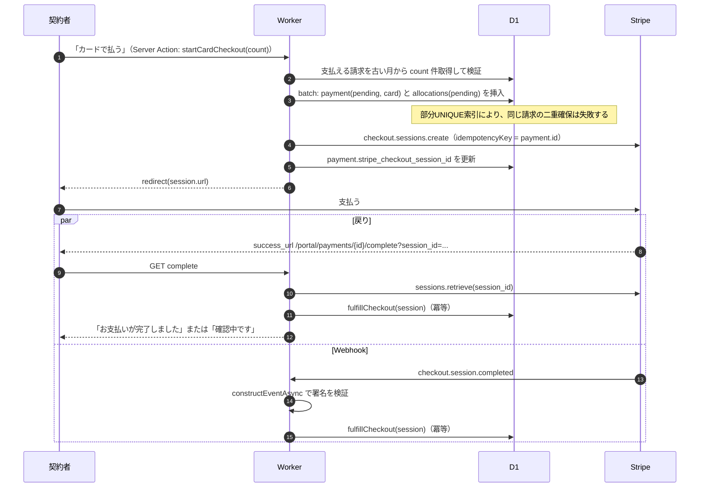
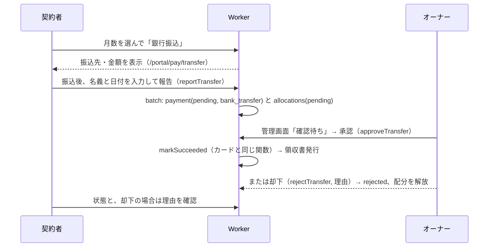

# 6. 請求・入金・決済・領収書

## 6.1 月の計算（`lib/domain/time.ts`）

```ts
export type YearMonth = `${number}-${string}` // "2026-09"
export const TZ = 'Asia/Tokyo'

export function currentMonth(now: Date): YearMonth // Intl.DateTimeFormat(timeZone: TZ) で求める
export function todayJst(now: Date): string // "2026-09-12"
export function addMonths(ym: YearMonth, n: number): YearMonth // 整数演算だけ。Dateを使わない
export function monthsBetween(from: YearMonth, to: YearMonth): YearMonth[] // 両端を含む
export function formatMonthJa(ym: YearMonth): string // "2026年9月"
export function formatDateJa(d: Date): string // "2026年9月12日"（JST）
```

時刻は必ず引数で受け取ります（`now = new Date()` を関数の奥で呼ばない）。月末や年またぎの境界（例: JST 1日0:00 = UTC 前日15:00）を単体テストで網羅します。

## 6.2 請求の生成: `syncInvoices`

**請求すべき月** = `monthsBetween(contract_start, min(contract_end ?? ∞, currentMonth + invoice_lead_months))`

`invoice_lead_months` の初期値は **1**（前払いを有効化。翌月分まで先に請求を作り、契約者は今月分と合わせて前もって支払える）。設定画面でオーナーが変更できる（§1.2 O-12, §7.4）。

```ts
async function syncInvoices(contractorIds: string[] | 'all', now: Date): Promise<void>
```

- 請求すべき月のうち、請求が無い月を `INSERT ... ON CONFLICT(contractor_id, month) DO NOTHING` で作る（金額はその時点の `monthly_fee`）。
- アーカイブ済みの契約者は対象外にする。
- 冪等なので、何度呼んでもよい。

**呼び出すタイミング**

| いつ                                              | 対象       |
| ------------------------------------------------- | ---------- |
| 契約者を作成・更新したとき（同じServer Action内） | その契約者 |
| 契約者画面（portal の layout）を表示したとき      | 本人       |
| 管理画面のダッシュボードを表示したとき            | 全員       |

Cronは使いません（D10）。10名規模なら、表示のたびに呼んでも1回あたりの書き込みは多くて数件です。

**契約期間を変更したとき**: 新しい期間の外になった `open` の請求のうち、配分（pending/applied）が無いものは `void`（理由「契約期間の変更」）にする。配分があるものは変更を止め、「入金済みの月を含むため、期間を短縮できません」と表示する。

**月額料金を変更したとき**: `contractors.monthly_fee` を更新する。これから作る請求に反映される。オプション「未入金の請求にも反映する」を選ぶと、配分が無い `open` の請求の `amount` も更新する（監査ログに変更前後の金額を残す）。

## 6.3 支払う請求の選び方（`lib/domain/billing.ts`）

- 契約者は「何か月分を払うか」だけを選ぶ（旧UIを踏襲）。**古い月から順に**N件の請求を選ぶ。
- 支払額 = 選んだ請求の残額の合計。配分 = 請求ごとの残額。
- オーナーが現金などを記録する場合は、請求を選んだうえで金額を入力できる。入力額に満たない場合は、古い月から順に充て、最後の1件が一部入金になる（`allocate(invoices, amount)`）。

```ts
export function allocate(
  invoices: { id: string; remaining: number }[],
  amount: number,
): { invoiceId: string; amount: number }[] // 合計がamountと一致する。残額を超えて充てない。超過したらエラー
```

## 6.4 カード決済（Stripe Checkout）



### `startCardCheckout(contractor, count)`

1. `settings.cardPaymentEnabled` を確認する。
2. `syncInvoices([contractor.id])` → 支払える請求を古い月から `count` 件取得する（件数が足りなければエラー）。
3. batch: `payments`（status=pending, method=card, channel=portal, amount=残額の合計）、`payment_allocations`（state=pending）
4. Stripe:
   ```ts
   stripe.checkout.sessions.create(
     {
       mode: 'payment',
       // payment_method_types は指定しない → ダッシュボードで有効にした決済手段（カード、Apple Pay、コンビニ払い等）が出る
       line_items: invoices.map((i) => ({
         quantity: 1,
         price_data: {
           currency: 'jpy',
           unit_amount: i.remaining,
           product_data: { name: `駐車場使用料 ${formatMonthJa(i.month)}分` },
         },
       })),
       client_reference_id: payment.id,
       metadata: { payment_id: payment.id, contractor_id: contractor.id },
       payment_intent_data: { metadata: { payment_id: payment.id } },
       expires_at: nowSec + 30 * 60,
       locale: 'ja',
       success_url: `${origin}/portal/payments/${payment.id}/complete?session_id={CHECKOUT_SESSION_ID}`,
       cancel_url: `${origin}/portal/payments/${payment.id}/complete?canceled=1`,
     },
     { idempotencyKey: `checkout:${payment.id}` },
   )
   ```
   `origin` はリクエストの `Host` から組み立てる（R28）。
5. Stripe APIの呼び出しが失敗したら、その入金を `canceled` にして配分を解放する。エラーを表示する。

### `fulfillCheckout(session, source)`（Webhookと戻り画面で共通、冪等）

1. `payment = payments where id = session.metadata.payment_id`。見つからなければログを出して終わる。
2. 検証: `session.amount_total === payment.amount`、`session.currency === "jpy"`。一致しなければ監査ログ（`payment.amount_mismatch`）に残し、処理しない。
3. 分岐:
   - `session.payment_status === "paid"` → **markSucceeded**
   - `"unpaid"`（コンビニ払いなど非同期の決済手段）→ pending のまま、`stripe_payment_method_type` だけ記録する（「お支払い待ち」と表示）
4. **markSucceeded** は1つの batch で実行する（すべて状態ガード付きなので冪等）:
   ```
   UPDATE payments SET status='succeeded', succeeded_at=?, stripe_payment_intent_id=?, stripe_payment_method_type=?
     WHERE id=? AND status='pending'
   UPDATE payment_allocations SET state='applied'
     WHERE payment_id=? AND state='pending' AND EXISTS(SELECT 1 FROM payments WHERE id=? AND status='succeeded')
   UPDATE invoices …（§4.6 の再計算）
   INSERT OR IGNORE INTO receipts …（§4.6 の採番）
   INSERT OR IGNORE INTO audit_logs (dedupe_key = 'fulfill:'||payment_id) …
   ```

### Webhook（`/api/webhooks/stripe`）

| イベント                                   | 処理                                              |
| ------------------------------------------ | ------------------------------------------------- |
| `checkout.session.completed`               | `fulfillCheckout`                                 |
| `checkout.session.async_payment_succeeded` | `fulfillCheckout`（この時点で paid になっている） |
| `checkout.session.async_payment_failed`    | pending → `failed`、配分を解放する                |
| `checkout.session.expired`                 | pending → `canceled`、配分を解放する              |
| その他                                     | 200を返して無視する                               |

```ts
export async function POST(req: Request) {
  const body = await req.text()
  const event = await getStripe().webhooks.constructEventAsync(
    body, req.headers.get("stripe-signature") ?? "", env.STRIPE_WEBHOOK_SECRET, undefined, webCrypto)
  // 失敗したら400
  await db.insert(stripe_events).values({ id: event.id, type: event.type, … }).onConflictDoNothing()
  await handle(event)            // 各処理は冪等なので、stripe_events は重複排除と記録のため
  return new Response(null, { status: 200 })
}
```

DBエラー時は500を返し、Stripeの再送に任せます（処理が冪等なので安全です）。

### 戻り画面（`/portal/payments/[id]/complete`）

- `canceled=1` の場合は、`stripe.checkout.sessions.expire()` を呼び、`canceled` にして配分を解放する。
- それ以外は `sessions.retrieve` → `fulfillCheckout` を呼び、payment の状態に応じて表示する（完了、コンビニでのお支払い待ち、確認中）。
- 本人の入金であることを確認する（`payment.contractor_id === 現在の契約者`）。

### Stripeダッシュボードでの設定

- 決済手段: カード（Apple Pay / Google Pay を含む）。**コンビニ払いは、手数料と入金サイクルを確認したうえでオーナーが有効にするか決める**。コードはどちらでも動く。
- Webhookエンドポイント: `https://<host>/api/webhooks/stripe`。上の4イベント。
- 明細書表記（statement descriptor）: 例 `PARKING TANAKA`
- 本番の申請: 事業者情報と、特定商取引法に基づく表記のURL（`/legal/tokushoho`）

## 6.5 銀行振込



- 振込名義の初期値は、契約者のフリガナ（`name_kana`）にする。
- 振込日の初期値は、JSTの今日にする。未来の日付は受け付けない。
- 承認するときは、金額を変えられない（金額が違う場合は、却下してから現金などとして記録し直す）。

## 6.6 現金などの記録（オーナー）

`recordManualPayment(owner, { contractorId, invoiceIds, amount, method: 'cash'|'bank_transfer'|'other', paidOn, note })`

- 対象の請求が本人のもので、`open` で、pending の配分が無いことを確認する。
- `allocate()` で配分を決め、batch で次を実行する: `payments`（succeeded, channel=admin, reviewed_by=owner）、`allocations`（applied）、請求の再計算、領収書の発行、監査ログ。

## 6.7 請求の免除

`voidInvoice(owner, invoiceId, reason)`: `applied` と `pending` の配分が無い場合だけ行える。監査ログに残す。

## 6.8 領収書

### 発行

- 入金が `succeeded` になったときに、同じbatchで1枚発行する（連番、発行時点の情報を保存）。
- 表示: 契約者は `/portal/payments/[id]/receipt`、オーナーは `/admin/payments/[id]/receipt`。どちらも `components/receipt/Receipt.tsx` を使う。
- 印刷とPDF保存はブラウザの印刷機能で行う（A5横または A4、`@media print`）。

### 記載項目（適格簡易請求書の要件を満たす）

| 項目     | 値                                                                                                        |
| -------- | --------------------------------------------------------------------------------------------------------- |
| 表題     | 領収書（登録番号がある場合は「領収書（適格簡易請求書）」）                                                |
| No.      | `receipt_no` を6桁でゼロ埋め（例: 000123）                                                                |
| 宛名     | `recipient_name` 様                                                                                       |
| 金額     | ¥`amount`-（税込）                                                                                        |
| 但し書き | `description`（例: 駐車場使用料 2026年10月分〜2026年12月分（区画A-3）。一部入金なら「（一部）」を付ける） |
| 内訳     | 10%対象 ¥`amount`（うち消費税 ¥`tax_amount`）                                                             |
| 取引日   | `transaction_date`（カードは決済日、振込は振込日、現金は受領日）                                          |
| 発行日   | `issued_at`（JST）                                                                                        |
| 支払方法 | クレジットカード等 / 銀行振込 / 現金 / その他                                                             |
| 発行者   | 屋号、住所、電話番号、登録番号（T+13桁）                                                                  |

- 消費税額 = `floor(amount × rate ÷ (100 + rate))`（1枚の領収書ごとに1回だけ端数処理する）
- 月極駐車場の賃貸は、原則として消費税の課税対象です（10%）。免税事業者の場合は、登録番号を空欄にすると通常の領収書として表示します。
- 電子的に交付する領収書は、印紙税の対象外です。紙に印刷して渡す運用の場合、5万円以上なら印紙が必要になる点を運用ガイドに記載します。
